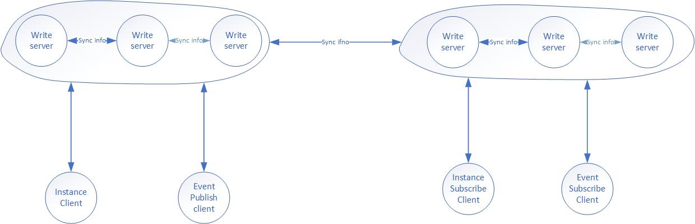

## 项目背景

## 介绍

wr-ty 是一款基于AP理论的服务发现框架，其使用grpc 作为传输层，支持语言客户端，支持实例信息订阅，实例订阅权限认证，支持横向水平扩充，支持分布式事件总线。

## 动机

一直想找一个提供实现服务发现功能的组件，功能齐全同时也尽量简单。最好不要引入外部集群，尽量不要或者少包含不相关的功能，最好是基于订阅模式的，具备较好的扩充性，最好是用java 编写的。曾经eureka 2.0 的架构我比较喜欢，可惜不开源了，具体原因也不是很清楚。2020 年新型冠状病毒大面积爆发，全国都封城了，不准人员外出，假期也延长了，所以借此空闲时机，尝试实现一个满足预期工功能的组件。本项目是对eureka2.0架构的一种实现，与功能扩充。

## 架构

## 实现功能列表

## 安装

## 交流方式

钉钉群：30383866

